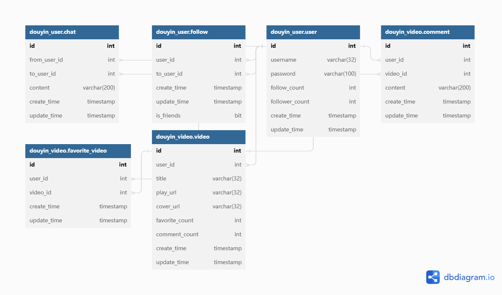

<h1 align="center" style="font-size:50px">douyin</h1>
<div align=center>


</div>


douyin是基于`go-zero`框架的一个极简版抖音的后端接口，为极简版抖音客户端提供后端服务。

## 功能介绍

- 视频：视频推送、视频投稿、发布列表
- 用户：用户注册、用户登录、用户信息
- 点赞：点赞操作、点赞列表
- 评论：评论操作、评论列表
- 关注：关注操作、关注列表、粉丝列表、好友列表
- 聊天：聊天操作、聊天记录

## 项目部署

对于`app/user/cmd/api/`，称之为`userApi`，同理`app/user/cmd/rpc/`称为`userRpc`，目录下的`etc`文件夹是配置文件夹

请先安装`docker`和`docker-compose`

- git clone
- 配置位于`fileRpc`下配置文件的oss信息
- 配置`userApi,userRpc,videoApi`下的jwt密钥
- 配置`common/globlkey/constantKey.go`中的`StaticFileServiceIP`字段
- 先使用`docker-compose build .`先将六个服务构建后， 再使用`docker-compose up -d`启动服务

## 接口文档

参考官方文档：[接口文档]([赞操作 - 极简版抖音 (apifox.cn)](https://www.apifox.cn/apidoc/shared-09d88f32-0b6c-4157-9d07-a36d32d7a75c/api-50707526))

## 数据库设计

视频和用户是两大实体，点赞，评论，关注，聊天这些操作建立新的表。

其中将用户，关注，聊天表存放于`douyin_user`库中，将视频，点赞，评论表存放于`douyin_video`库中。

设计以下数据库（sql文件位于`/deploy/sql`）



> 这里所有的外键都是逻辑外键，通过事务保证数据的正确性。

## 技术选型

本项目采用基于`go-zero`的RPC框架，包含了`go-zero`以及相关`go-zero`作者开发的一些中间件，所用到的技术栈基本是`go-zero`
项目组的自研组件。

- Go-zero
- Mysql
- Redis
- Oss
- ffmpeg

## 服务架构

| 服务名    | 用途                               | 框架                 | 协议       |
| :-------: | :--------------------------------: | :------------------: | :--------: |
| user-api  | 处理用户相关http请求 | `go-zero`            | `http`     |
| user-rpc  | 处理用户相关的rpc请求 | `go-zero` `redis` `mysql` | `protobuf` |
| video-api | 处理视频相关http请求 | `go-zero` | `http` |
| video-rpc | 处理视频相关的rpc请求          | `go-zero` `redis` `mysql` |`protobuf`|
| file-api | 静态文件资源访问 | `net/http` |`http`|
| file-rpc | 上传文件 | `go-zero` `oss` `ffmpeg` |`protobuf`|

## 调用关系


不同的请求通过nginx反向代理到不同的api服务中，api通过直连的方式连接rpc，rpc同理。

## 目录结构

```

├─app						// 应用
│  ├─file					// 文件服务
│  ├─user					// 用户服务
│  │  ├─cmd					// 用户服务代码
│  │  │  ├─api				// api 服务
│  │  │  │  ├─desc			// api文件
│  │  │  │  ├─etc			// 配置文件
│  │  │  │  └─internal		// 内部逻辑
│  │  │  └─rpc				// rpc 服务
│  │  │      ├─etc		
│  │  │      ├─internal
│  │  │      ├─pb			// 定义rpc服务的protobuf文件
│  │  │      └─userrpc
│  │  └─model				// orm层
│  └─video
├─common					// 通用代码
├─data						// 存放docker映射目录数据和日志文件
├─deploy					// 部署文件
├── docker-compose.yaml     // 启动服务的docker-compose文件
├── down.sh					// 一键删除服务和代码（慎用）
├── go.mod
└─ README.md               
```

